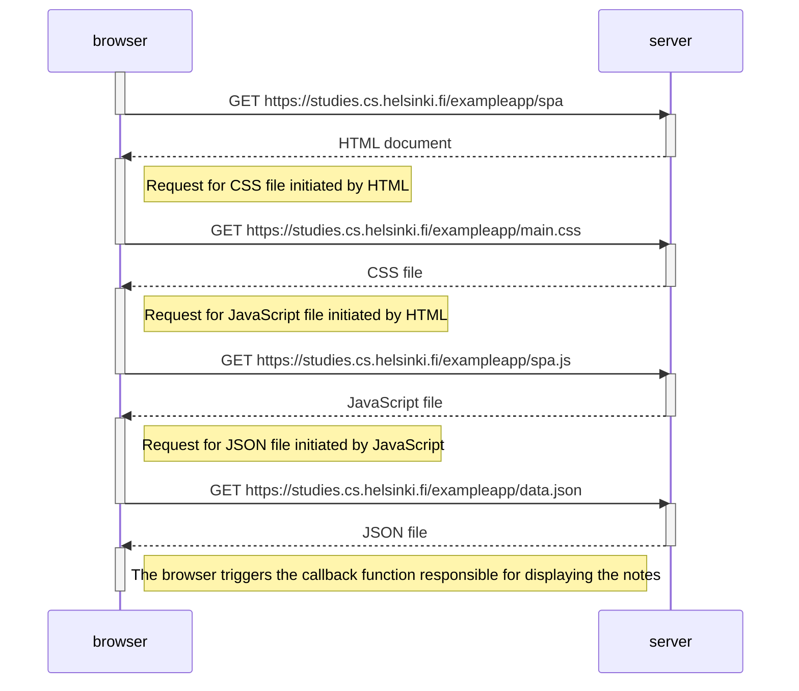

```mermaid
sequenceDiagram
    participant browser
    participant server

    activate browser
    browser->>server: GET https://studies.cs.helsinki.fi/exampleapp/spa
    deactivate browser

    activate server
    server-->>browser: HTML document
    deactivate server

    activate browser
    Note right of browser: Request for CSS file initiated by HTML
    browser->>server: GET https://studies.cs.helsinki.fi/exampleapp/main.css
    deactivate browser

    activate server
    server-->>browser: CSS file
    deactivate server

    activate browser
    Note right of browser: Request for JavaScript file initiated by HTML
    browser->>server: GET https://studies.cs.helsinki.fi/exampleapp/spa.js
    deactivate browser

    activate server
    server-->>browser: JavaScript file
    deactivate server

    activate browser
    Note right of browser: Request for JSON file initiated by JavaScript
    browser->>server: GET https://studies.cs.helsinki.fi/exampleapp/data.json
    deactivate browser

    activate server
    server-->>browser: JSON file
    deactivate server

    activate browser
    Note right of browser: The browser triggers the callback function responsible for displaying the notes
    deactivate browser
```
