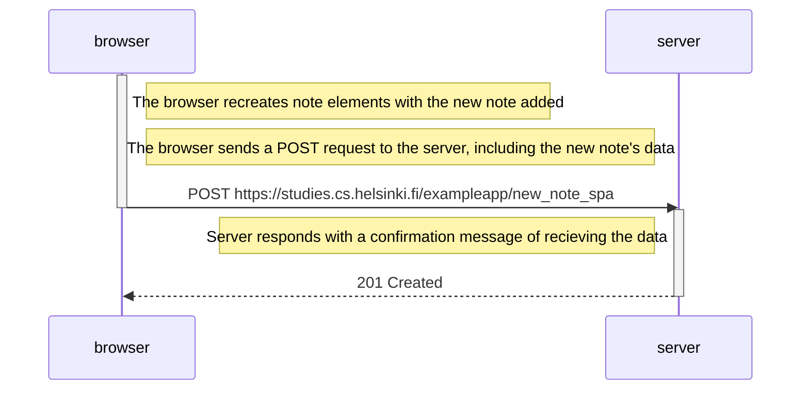

```mermaid
sequenceDiagram
    participant browser
    participant server

    activate browser
    Note right of browser: The browser recreates note elements with the new note added
    Note right of browser: The browser sends a POST request to the server, including the new note's data
    browser->>server: POST https://studies.cs.helsinki.fi/exampleapp/new_note_spa
    deactivate browser

    activate server
    Note left of server: Server responds with a confirmation message of recieving the data
    server-->>browser: 201 Created
    deactivate server
```
